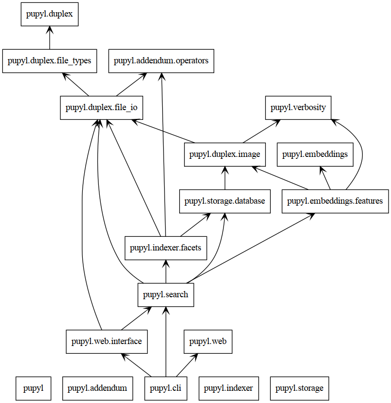
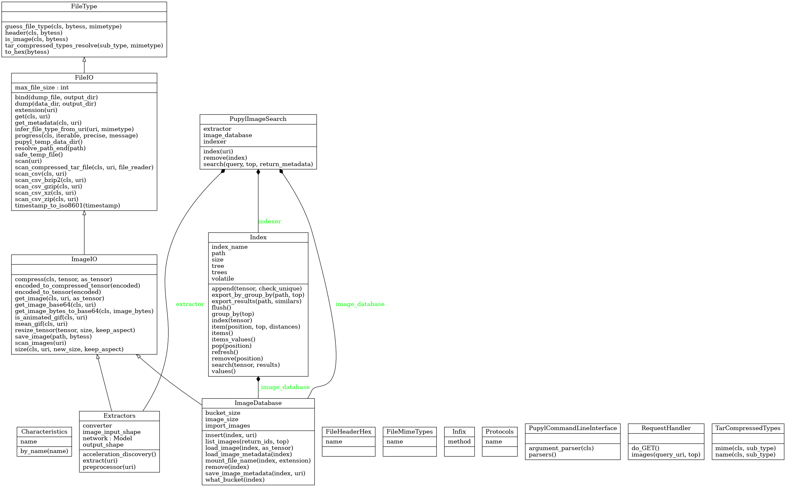

🧰 Classes and Packages
========================

A glimpse over the whole structure and organization of every package and
class on ``pupyl``.

🏷️ Packages
############
How every module or package relates to each other.

🪧 Classes
###########
All classes depicted with its members and inheritances.

